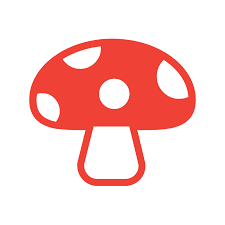
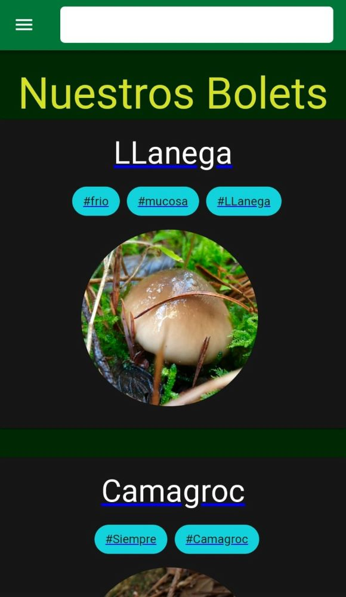
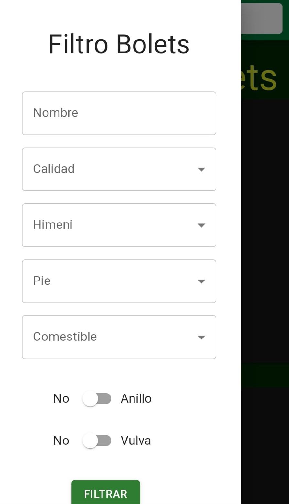
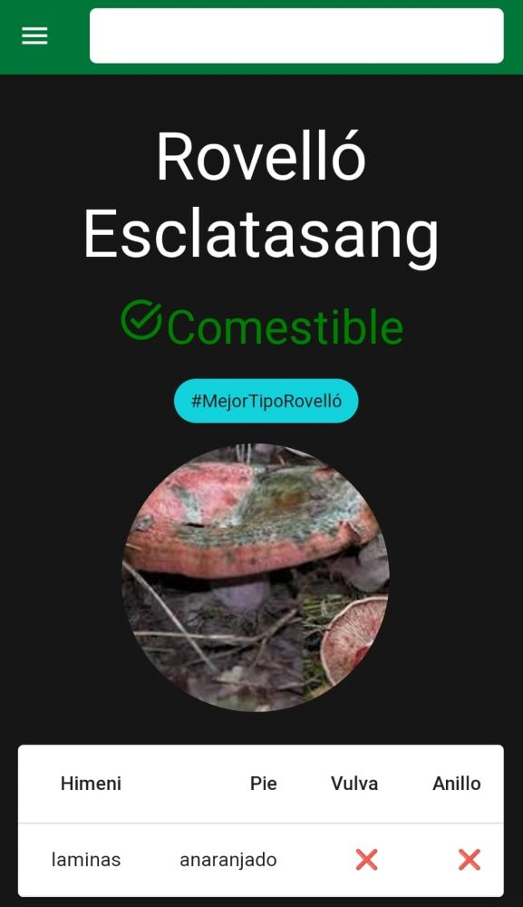

# Bolet.App

 
 

 
 

 

---

This project is made with [Create React App](https://github.com/facebook/create-react-app) and [Material UI](https://mui.com/) v5.10.15 .

 

## `Description`

BoletApp is a progressive web application that allows you to learn, identify and view the characteritics about Mushrooms. 
On the main page we will find all our mushrooms.
Thanks to the navigation bar we can acces a search bar and in the left menu some filters that will help us identify them.
Click here for view deployed application -> https://elisabethmartinezmembrado.github.io/Bolets/

---
## `Requirements` 
* NodeJS
* Npm
---

## `Views`
### Home

### Filters

### File

---

## `Functions`

`The component Home`

- Make the request GET to the API and receives the data.

- Sets and retrieves parameter values.

- Normalize user search.

- Filter the search and show it.

`The component Card`

- Receives Home props

- Shows each mushroom by the id.

`The component Loading Card`

- Until the letter receives the infromation, it shows the skeleton os the page.

`The component Navbar`

- Render the search bar

- Activate the side menu on the left.

- Send user search to Home

`The component Filter`

- Make the API call to create the options buttons.

- Render buttons and trigger the user search.

- Send the filters to Home for render.

`The component Details`

- Make the request to Api.

- Save data in Component state

- Save data in navigation cache to provide offline service

- When it receives the data it passes the props to the data sheet.

`The component Data Sheet`

- Receives the Details props.

- Render the data to selection mushroom to help your recognition.

`The component Skeleton Data Sheet`

-  Until data sheet receives the information, it shows the skeleton of the page.

---
## `Instalation`

1 - Download the app on GitHub. For this we clone the project and copy the url of the project.

2 - From the console we open the project folder and with comand `npm instal`, we download the packages.

3- To the open local server, we type `npm start`.

---

## `CD (Continuous Deployment)`

The CI provider is GitHub Actions.
The project inlcudes a Pipeline in .yml format.

## `Upgrade ideas`

* The client will be abel to add mushrooms and modify them.

* Inlcude a favorite mushroom location for better acces.

* Improve filters

* Paginate content
---

## `Contributions`

All contribution forit improvement will be welcome.

---

## `Licence`

Copyright 2022 Elisabeth Martinez Membrado.
Permission is hereby granted, free of charge, to any person obtaining a copy of this software and associated documentation files (the "Software"), to deal in the Software without restriction, including without limitation the rights to use, copy, modify, merge, publish, distribute, sublicense, and/or sell copies of the Software, and to permit persons to whom the Software is furnished to do so, subject to the following conditions:

The above copyright notice and this permission notice shall be included in all copies or substantial portions of the Software.

THE SOFTWARE IS PROVIDED "AS IS", WITHOUT WARRANTY OF ANY KIND, EXPRESS OR IMPLIED, INCLUDING BUT NOT LIMITED TO THE WARRANTIES OF MERCHANTABILITY, FITNESS FOR A PARTICULAR PURPOSE AND NONINFRINGEMENT. IN NO EVENT SHALL THE AUTHORS OR COPYRIGHT HOLDERS BE LIABLE FOR ANY CLAIM, DAMAGES OR OTHER LIABILITY, WHETHER IN AN ACTION OF CONTRACT, TORT OR OTHERWISE, ARISING FROM, OUT OF OR IN CONNECTION WITH THE SOFTWARE OR THE USE OR OTHER DEALINGS IN THE SOFTWARE.

